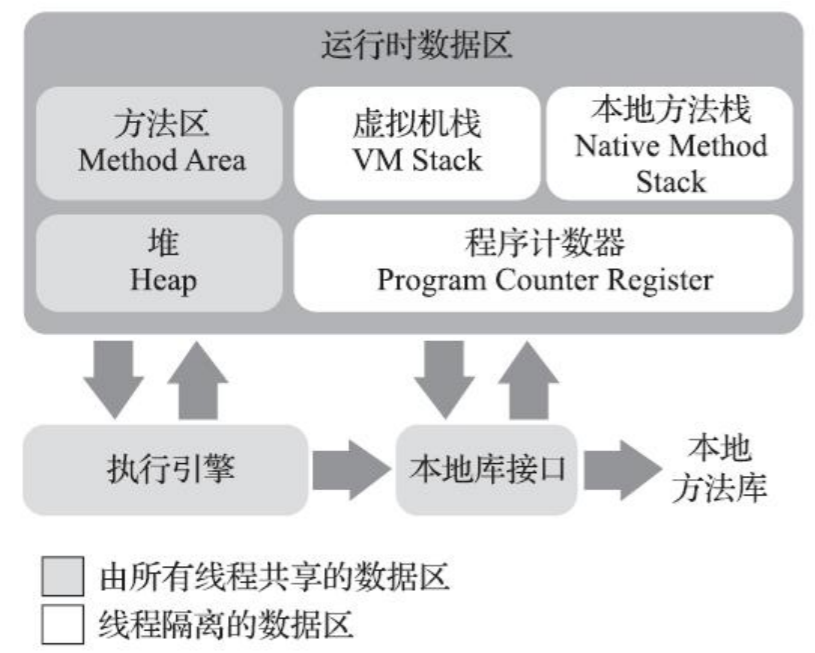

# 一.Java内存区域与内存溢出异常

java不同意出现内存泄漏和内存溢出，一旦出现这方面问题，如果不了解虚拟机是怎样使用内存的，那排查修正问题将是一项艰巨的工作。

## 1.1运行时数据区域

### 1.1.1程序计数器

是一块较小的内存空间，可以看作是当前线程所执行的字节码的行号指示器。每个线程私有的，此区域是《java虚拟机规范》中唯一没有规定任何OutOfMemoryError的情况

### 1.1.2Java虚拟机栈

线程私有，生命周期与线程相同。每个方法被执行时，虚拟机都会同步创建一个栈帧，用于存储**局部变量表，操作数栈，动态连接，方法出口**等。

局部变量表存储变量、引用等，除long和double类型占用两个变量槽(slot)外，其他只占一个。方法运行期间，局部变量表大小是确定的（slot数量不变）。会抛出StackOverflowError和OutOfMemoryError异常

### 1.1.3本地方法栈

虚拟机栈为java方法服务，本地方法栈为本地方法服务。有时会把前述两个栈合二为一。

### 1.1.4java堆

- 堆是虚拟机管理的内存中最大的一块

- **java堆被所有的线程共享**

- 唯一目的就是存放对象实例

- 垃圾收集器管理的区域，也叫GC堆
- 物理上不一定是连续的内存空间，但在逻辑上一定是连续的。
- 可能会抛出OutOfMemoryError异常

可以把堆根据线程划分成多个区域，线程私有的分配缓冲区(**TLAB**),开启这个功能可以通过**-XX：+/-UseTLAB**参数设定。

Java堆大小可以通过参数**-Xmx和-Xms**设置

### 1.1.5 方法区

所有线程共享的区域，用于存储已被虚拟机加载的类型的信息、常量、静态变量、即时编译器编译后的代码缓存等数据。

### 1.1.6运行时常量池

运行时常量池是方法区的一部分，Class文件中有一项信息是常量池表，用于存放编译期生成的各种字面量和符号引用，这部分内同将在类加载后存放到这部分内存区域中。

### 1.1.7直接内存

比如基于通道和缓冲区的NIO类，它使用Native函数库直接分配**堆外内存**，然后通过一个存储在Java堆里的DirectByteBuffer对象作为这块内存的引用进行操作。可能会抛出OutOfMemoryError异常。

## 1.2HotSpot虚拟机

### 1.2.1对象创建

虚拟机遇到字节码new指令时，先才常量池中查到这个类的符号引用，并且检查这个类是否已经被加载、解析和初始化过，如果没有，必须先执行类加载过程。类加载后，就给新生对象分配内存。

内存分配方式：

- 指针碰撞：使用过和空闲的堆内存各在一边，使用指针标记界线
- 空闲列表：内存交错，需要维护一张列表记录哪些内存可以使用

哪种分配方式由采用的垃圾收集器是否具有空间压缩整理(compact)的能力决定的.

多线程下的指针碰撞分配方式：

- CAS加上失败重试保证原子性
- 本线程的内存分配只在本线程私有的分配缓冲区(**TLAB**)中分配

分配内存之后，需要**初始化**为零值

之后，设置**对象头**相关信息。（到这一步，从虚拟机的角度，一个对象已经创建完成了）。

最后，执行构造函数（即class文件中的<init>方法）。

