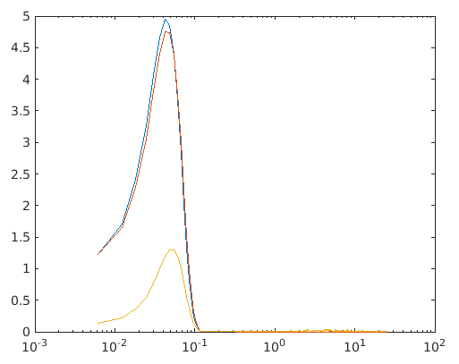
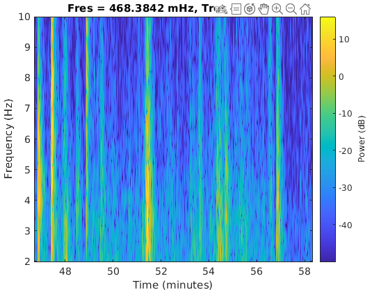

## 预处理

下面的步骤按顺序进行！

### 插值：

使各点之间的距离相等（可能相邻三点之间间隔不一致）：函数**resample**

注意点：

1. 各个信号的采样率要相等,不相同的信号可以使用插值(resample)时升采样或者降采样，使处理后的信号形同采样率。
2. 每个信号采样要有相同的时间跨度范围（**synchronize**函数处理）

提取到的最高频率的信息由最低采样率决定

降采样会使信号丢失高频信息，但是升采样并不会让你获得高频信息。

wanc = **timetable**(harp.Time,**resample**(wanc.Signal,1,2),'VariableNames',"Signal")  使wanc.Signal的频率变为原来的**1/2**倍

### 归一化

data = **normalize**(data)，归一化信号，不同信号的幅度可能不一样，所以要归一化，有的应用中，信号的幅度并不影响结果。

### 信号对齐

不同测量单元距离信号源的距离不同，导致接收到的信号之间有延迟，所以要对齐。常用互相关函数**finddelay、xcorr**

未对齐之前的两个信号：

#### xcorr

[c,lags] = **xcorr**(harp.Signal,wanc.Signal)  计算两个信号的相关函数

**stem**(lags,c)  可视化xcorr的输出

上图中0附近存在尖峰，说明可以找到这两个互相关信号之间的延迟。

#### finddelay

如果两个信号存在足够互相关性，finddelay可以找到他们之间的相对延迟

harpDelay = **finddelay**(harp.Signal,wanc.Signal)，输出harpDelay 是一个整数，表示滞后样本的数量，要找到秒数，您可以将样本与时间步长相乘。

harp.Properties.**StartTime** = **seconds**(harpDelay*Ts(1))  Ts(1)表示时间步长

### 同步

不同信号间的同步用synchronize函数

quakes = **synchronize**(harp,pax,wanc) 同步三个信号

quakes.Properties.**VariableNames** = ["HARP" "PAX" "WANC"] 可以给quakes 的列命名

### NaN值处理

同步之后，各维信号的前后可能存在Nan值，存在NaN值就不能使用频谱函数，所以可以使用截取信号，使信号不包含NaN值。

timeLimits = timerange(seconds(2800),seconds(3500));  截取2800-3500s的时间序列

quakesROI = quakes(timeLimits,:);  截取信号

**stackedplot**(quakesROI)  快速画出三维信号的时域图

## 频谱分析

**pspectrum**(quakes,"FrequencyLimits",[0 1])  显示0到1hz之间的quakes的频谱

[p,f] = **pspectrum**(quakes)  如果 quakes包含多个信号，则 p是一个矩阵，其中每一列是每个信号的频谱。f使横轴点频率列表

**semilogx**(f,p)  这个可以显示半对数频谱图，横轴是f的半对数，这样可以更好地显示频率特性。

semilogx(f,db(p,"power"))  dp函数可以对y轴数据进行调整，**db(p)就是10*log10(p)**,这个转换之后y轴地单位才是真正地dB

## 时频分析

光看频谱图不能确定某一频率的信号是在什么时候发生的，这时候就可以使用时频分析。通常由下面两种方法。都是先把信号按照时间顺序分成不同的块，然后分别计算每个块的频谱，之后把频谱拼在一起，

### Spectrogram

sin wave，函数pspectrum，显示**功率**

pspectrum(quakes.WANC,quakes.Time,"spectrogram","FrequencyLimits",[2 10],"MinThreshold",-50)

显示2-10hz并且阈值为-50dB以上的时频信息

### Scalogram

wavelet，函数cwt，显示**幅度**

cwt(quakes.WANC,1/0.02,"FrequencyLimits",[2 10]);   其中1/0.02是采样率，显示2-10hz的频率

caxis([0 2])   cwt 函数没有 MinThreshold 选项，但您可以通过设置颜色图限制来获得相同的效果。

怎么选择这俩？就看待处理的原始信号长得咋样。

## 滤波

Matlab中Filter Designer这个App可以设计滤波器

上面图都是函数，Steepness是用来调节过渡带的宽度或者倾斜程度的。

lowWANC =  **lowpass**(quakes(:,"WANC"),0.1);   0.1表示截止频率

quakes.FiltWANC = lowWANC.WANC

figure

**stackedplot**(quakes)  画出所有信号和处理后的一个信号

lowWANC = **lowpass**(quakes(:,"WANC"),0.1,"Steepness",0.95);   修改通带陡峭程度，重新运行

可以看到，修改成0.95的通带斜率之后，滤波的效果更加好。

## 信号测量

live Editor->task->find local extrema  可以找到图画中的极值点，还有其他的一些工具可以使用。

